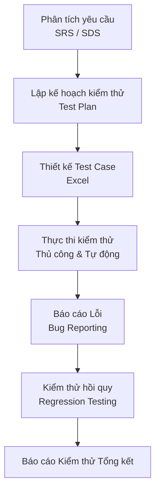

<div align="center">
  
# Portfolio Kiểm Định Phần Mềm - Nupakachi


Một Portfolio Quản lý Chất lượng Phần mềm (QA) toàn diện, thể hiện các kỹ năng về kiểm thử thủ công, kiểm thử tự động, API và kiểm thử hiệu năng cho nền tảng thương mại điện tử.

</div>

---

## 📖 Tổng quan dự án

Kho lưu trữ (repository) này chứa các tài liệu kiểm thử phần mềm từ đầu đến cuối (end-to-end) và các kịch bản kiểm thử tự động cho **Nupakachi** (một trang web thương mại điện tử và dịch vụ ảnh cưới). Dự án mô phỏng quy trình làm việc thực tế của một Kỹ sư QA, thể hiện sự thành thạo trong việc phân tích yêu cầu, lập kế hoạch kiểm thử, thiết kế test case thủ công và triển khai hệ thống kiểm thử tự động.

## 🎯 Mục tiêu

- Thiết lập một quy trình QA chuẩn mực từ bước thu thập yêu cầu cho đến báo cáo lỗi (Bug reporting).
- Tự động hóa các luồng người dùng quan trọng (như Thanh toán, Thêm vào giỏ hàng) để giảm thời gian kiểm thử hồi quy.
- Xác thực tính toàn vẹn của các API backend.
- Đảm bảo hệ thống có thể chịu được tải lượng người dùng truy cập đồng thời mà không bị treo.
- Tạo ra một kho lưu trữ kiểm thử chuyên nghiệp, dễ bảo trì và có khả năng mở rộng.

## 🔎 Phạm vi kiểm thử

Phạm vi kiểm thử tập trung vào các chức năng thương mại điện tử cốt lõi:
- Xác thực người dùng (Đăng nhập / Đăng ký)
- Tìm kiếm & Duyệt sản phẩm
- Thao tác với Giỏ hàng
- Thanh toán & Xử lý đơn hàng

## 🛠️ Chiến lược kiểm thử

Dự án sử dụng chiến lược kiểm thử kết hợp:
1. **Kiểm thử thủ công (Hộp đen)**: Kiểm thử khám phá và có cấu trúc để xác thực UI/UX và các yêu cầu chức năng.
2. **Kiểm thử tự động UI**: Sử dụng Selenium WebDriver và BDD (SpecFlow) để tự động hóa các luồng nghiệp vụ quan trọng.
3. **Kiểm thử API**: Xác thực các endpoint REST API, mã trạng thái (status code), thời gian phản hồi và cấu trúc dữ liệu bằng Postman.
4. **Kiểm thử hiệu năng (Performance)**: Kiểm tra sức chịu tải của ứng dụng khi có lượng truy cập lớn bằng Apache JMeter.

## 🔄 Quy trình kiểm thử



## 💻 Công nghệ sử dụng

| Phân loại | Công cụ & Công nghệ |
| --- | --- |
| **Ngôn ngữ lập trình** | C# (.NET) |
| **Tự động hóa UI** | Selenium WebDriver |
| **Framework kiểm thử** | NUnit |
| **Framework BDD** | SpecFlow / Reqnroll |
| **Kiểm thử API** | Postman |
| **Kiểm thử Hiệu năng** | Apache JMeter |
| **Tài liệu** | MS Word, Excel, Markdown |

## 📂 Cấu trúc thư mục

```text
Nupakachi-Software-Testing/
├── README.md
├── docs/                      # Tài liệu QA
│   ├── requirements/          # Tài liệu yêu cầu (SRS, SDS)
│   ├── planning/              # Kế hoạch kiểm thử (Test Plan)
│   └── reports/               # Báo cáo thực thi kiểm thử
├── test-cases/                # Các file Excel kịch bản kiểm thử
├── automation/                # Kịch bản kiểm thử tự động
│   ├── ui/                    # Script Selenium WebDriver
│   └── unit/                  # Unit test với NUnit
├── api-testing/               # Cấu hình Postman
│   ├── collections/           # File JSON Postman Collection
│   ├── environments/          # Biến môi trường Postman
│   └── reports/               # Báo cáo chạy API
├── performance-testing/       # Cấu hình Apache JMeter
│   ├── scripts/               # File kịch bản .jmx
│   └── reports/               # Báo cáo dạng HTML Dashboard
├── bug-reports/               # Tài liệu theo dõi lỗi
├── screenshots/               # Hình ảnh minh họa & bằng chứng chạy test
└── assets/                    # Hình ảnh logo dự án
```

## 📄 Tài liệu kiểm thử (Test Artifacts)

- **Đặc tả Yêu cầu Phần mềm (SRS)**: Định nghĩa các yêu cầu kinh doanh và kỹ thuật.
- **Đặc tả Thiết kế Phần mềm (SDS)**: Kiến trúc hệ thống và thiết kế cơ sở dữ liệu.
- **Kế hoạch Kiểm thử (Test Plan)**: Chiến lược toàn diện nêu rõ phạm vi, tài nguyên, lịch trình và rủi ro.
- **Kịch bản Kiểm thử (Test Cases)**: Thiết kế test case trên Excel bao quát các trường hợp tích cực, tiêu cực và ranh giới.

## 🤖 Kiểm thử Tự động Giao diện (UI Automation)

Tự động hóa giao diện được triển khai bằng **C#** và **Selenium WebDriver**, tích hợp với **SpecFlow** để hỗ trợ Phát triển Hướng hành vi (BDD).
- **Chức năng được test**: Quy trình Thanh toán từ đầu đến cuối, xác thực Giỏ hàng.
- **Điểm nổi bật**: Sử dụng các file Feature của SpecFlow giúp kịch bản test dễ đọc và thân thiện với con người.

## 🔌 Kiểm thử API

RESTful API được kiểm thử thông qua **Postman**.
- **Phạm vi**: Xác thực các endpoint Quản lý giỏ hàng và Đăng nhập.
- **Tiêu chí đánh giá**: Mã trạng thái HTTP (200 OK), giới hạn Thời gian phản hồi (<3000ms), và kiểm tra cấu trúc dữ liệu trả về.

## ⚡ Kiểm thử Hiệu năng

**Apache JMeter** được dùng để giả lập tải lượng người dùng và xác thực độ tin cậy của hệ thống.
- **Kịch bản**: Giả lập nhiều người dùng đồng thời truy cập nền tảng Nupakachi.
- **Chỉ số theo dõi**: Lưu lượng (Throughput), Tỷ lệ Lỗi (Error Rate), Thời gian phản hồi trung bình (Average Response Time), và phân vị 90 (90th Percentile).

## 📸 Hình ảnh minh họa (Screenshots)

*(Ảnh sẽ được bổ sung vào thư mục `screenshots/`)*
- Thực thi kiểm thử Selenium
- Kết quả test API trên Postman
- HTML Dashboard của JMeter
- Bảng Test Case trên Excel
- Kế hoạch kiểm thử
- Giao diện Trang chủ

## 💡 Bài học rút ra

- **Tích hợp BDD**: Việc kết hợp SpecFlow với Selenium giúp kịch bản kiểm thử dễ hiểu hơn đối với những người không chuyên kỹ thuật, nhưng đòi hỏi việc quản lý step-definition phải thật khắt khe.
- **Quản lý Dữ liệu Test**: Fix cứng (hardcode) dữ liệu test sẽ làm script dễ gãy; việc sử dụng file cấu hình bên ngoài hoặc biến môi trường là bắt buộc.
- **API vs UI Testing**: Ưu tiên viết test ở tầng thấp (API) mang lại phản hồi nhanh và ổn định hơn so với việc tập trung quá nhiều vào tự động hóa UI nặng nề.

## 🚀 Hướng phát triển trong tương lai

- **Chuyển đổi sang Page Object Model (POM)**: Tái cấu trúc script Selenium sang dạng POM để dễ bảo trì và tránh lặp code.
- **Tích hợp CI/CD**: Áp dụng GitHub Actions để tự động kích hoạt chạy test mỗi khi có Pull Request mới.
- **Dữ liệu Test Động**: Dùng dữ liệu từ file ngoài (CSV/JSON) để chạy Data-Driven Testing cho Postman và Selenium.
- **Nâng cấp Assertions**: Thêm JSON Schema validation cho Postman và Response Assertions cho JMeter.

## 👥 Nhóm phát triển

Được phát triển bởi Nhóm 11 (Đồ án môn Kiểm định phần mềm):
- Hồ Chí Dũng
- La Thuận Phát
- Nguyễn Thị Thùy Dương
- Lê Thị Tuyết Nhi
- Trần Quốc Trường
